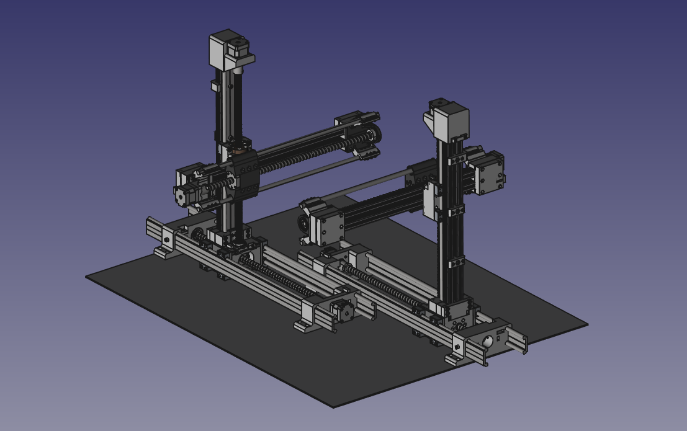

# Cartesian Robots Digital Twin

Master's degree project. Functional pair of robots with digital twin made in FreeCAD. Repository consist all elements to build and program hardware and software.

    

## Contents

1. digitalTwin - FreeCAD project containing simplified models of robots with calculations,
2. documentation - 2D documentation of robots,
3. electronics - electronics schematic with designed board in KiCAD; used to connect motors with Arduino,
4. model - Autodesk Inventor model with .step export; additional FreeCAD designed t-slot nuts.
5. software - Arduino Uno code; FreeCAD macro for digitalTwin; misc - udev rules, examples; Qt ui.

## License

SOFTWARE: MIT
HARDWARE: CERN OHL v2, unless specified below

Igus® parts:
https://www.igus.eu/info/company-terms-and-conditions-de#section_15

Item® parts:
https://pl.item24.com/en/terms-and-conditions/

Autodesk Inventor Content Center files can have their own license.

## Acknowledgments

People involved in pre-alpha versions of CAD model: Wojciech Pyka, Maksymilian Jędrzejowski, Mateusz Chudy, Witold Krafczyk, Olaf Tokarczyk.

Maksymilian Jędrzejowski:
https://omega.polsl.pl/info/author/PSLde2ebd91c94b4b639f68adfb76bbbfe9?r=publication&ps=20&title=Profil%2Bosoby%2B%25E2%2580%2593%2BMaksymilian%2BJ%25C4%2599drzejowski%2B%25E2%2580%2593%2BPolitechnika%2B%25C5%259Al%25C4%2585ska&lang=pl&pn=1

Witold Krafczyk:
https://omega.polsl.pl/info/author/PSL3ab3095431ce463fbf17f6ad56f56e03?r=publication&ps=20&title=Profil%2Bosoby%2B%25E2%2580%2593%2BWitold%2BKrafczyk%2B%25E2%2580%2593%2BPolitechnika%2B%25C5%259Al%25C4%2585ska&lang=pl&pn=1
